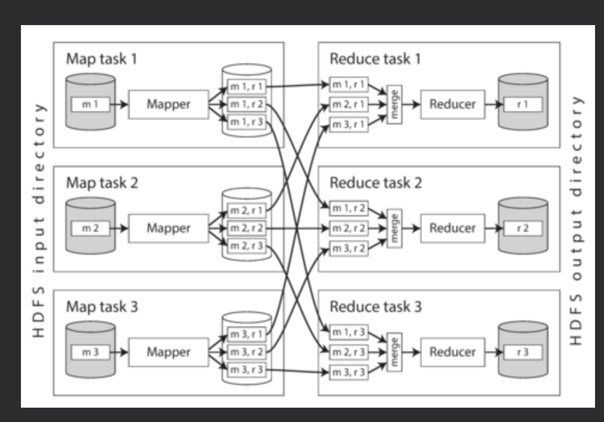

# Batch Processing with Unix Tool

Unix **sort** command: chunks of data can be sorted in memory and written out to disk as segment files, and then multiple sorted segments can be merged into a larger sorted file. Mergesort has sequential access patterns that perform well on disks.

The sort utility in GNU Coreutils (Linux) automatically handles larger-than-memory datasets by spilling to disk, and automatically parallelizes sorting across multiple CPU cores. This means that the simple chain of Unix commands we saw earlier easily scales to large datasets, without running out of memory. The bottleneck is likely to be the rate at which the input file can be read from disk.”

# MapReduce and Distributed Filesystems

HDFS is based on the shared-nothing principle, in contrast to the shared-disk approach of Network Attached Storage (NAS) and Storage Area Network (SAN) architectures. Shared-disk storage is implemented by a centralized storage appliance, often using custom hardware and special network infrastructure such as Fibre Channel. On the other hand, the shared-nothing approach requires no special hardware, only computers connected by a conventional datacenter network.

HDFS consists of a daemon process running on each machine, exposing a network service that allows other nodes to access files stored on that machine (assuming that every general-purpose machine in a datacenter has some disks attached to it). A central server called the **NameNode** keeps track of which file blocks are stored on which machine. Thus, HDFS conceptually creates one big filesystem that can use the space on the disks of all machines running the daemon.

machine <----- NameNode server -----> machine

In order to tolerate machine and disk failures, file blocks are replicated on multiple machines. Replication may mean simply several copies of the same data on multiple machines.“The techniques are similar to RAID, which provides redundancy across several disks attached to the same machine; the difference is that in a distributed filesystem, file access and replication are done over a conventional datacenter network without special hardware.

# MapReduce Job Execution

- Mapper

  - The mapper is called once for every input record, and its job is to extract the key and value from the input record. For each input, it may generate any number of key-value pairs (including none). It does not keep any state from one input record to the next, so each record is handled independently.

- Reducer
  - The MapReduce framework takes the key-value pairs produced by the mappers, collects all the values belonging to the same key, and calls the reducer with an iterator over that collection of values. The reducer can produce output records (such as the number of occurrences of the same URL).”

## Distributed execution of MapReduce

The input to a job is typically a directory in HDFS, and each file or file block within the input directory is considered to be a separate partition that can be processed by a separate map task.

Each input file is typically hundreds of megabytes in size. The MapReduce scheduler (not shown in the diagram) tries to run each mapper on one of the machines that stores a replica of the input file, provided that machine has enough spare RAM and CPU resources to run the map task. This principle is known as putting the computation near the data: it saves copying the input file over the network, reducing network load and increasing locality.

