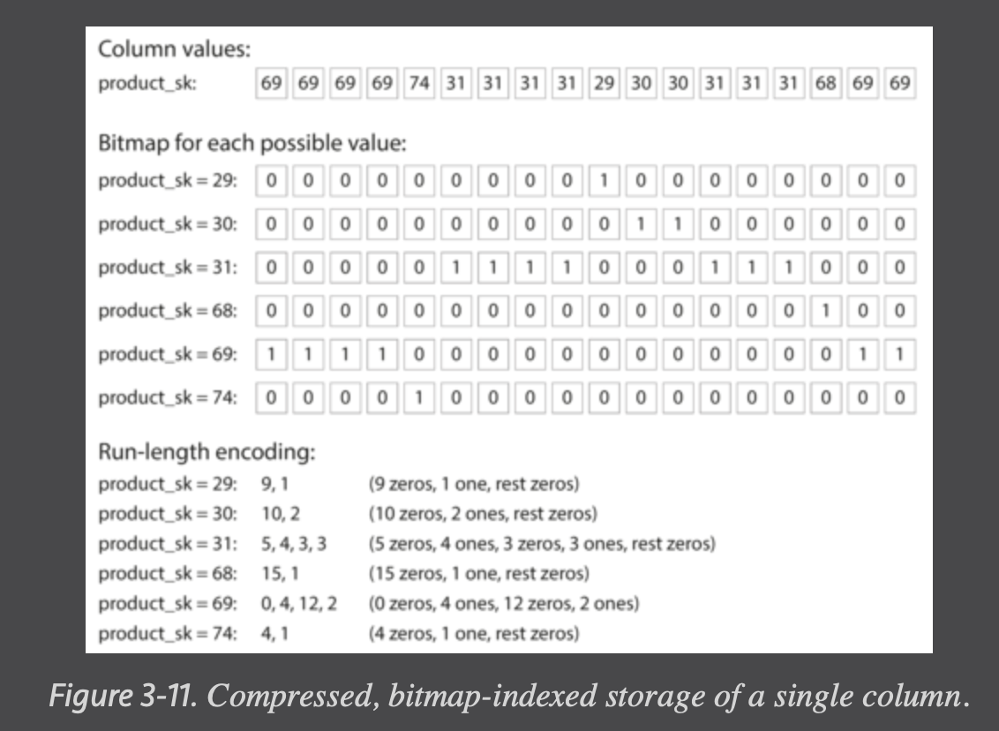

# Data Structures That Power Your Database

Without index, read operation will take O(n) time to scan through the entire database.

An index is an additional structure that is derived from the primary data. Many databases allow you to add and remove indexes, and this doesn’t affect the contents of the database; it only affects the performance of queries. Maintaining additional structures incurs overhead, especially on writes. For writes, it’s hard to beat the performance of simply appending to a file, because that’s the simplest possible write operation. Any kind of index usually slows down writes, because the index also needs to be updated every time data is written.

This is an important trade-off in storage systems: well-chosen indexes speed up read queries, but every index slows down writes. For this reason, databases don’t usually index everything by default, but require you—the application developer or database administrator—to choose indexes manually, using your knowledge of the application’s typical query patterns. You can then choose the indexes that give your application the greatest benefit, without introducing more overhead than necessary.

## Hash indexes

Keep an **in-memory** hash map where every key is mapped to a byte offset in the data file—the location at which the value can be found.

The values can use more space than there is available memory, since they can be loaded from disk with just one disk seek. If that part of the data file is already in the filesystem cache, a read doesn’t require any disk I/O at all.

Break the log into segments and do compaction to throw away duplicate keys in the log, and keeping only the most recent update for each key. This will save the disk space and prevent problem like running out of disk space.

Moreover, since compaction often makes segments much smaller (assuming that a key is overwritten several times on average within one segment), we can also merge several segments together at the same time as performing the compaction. Segments are never modified after they have been written, so the merged segment is written to a new file. The merging and compaction of frozen segments can be done in a background thread, and while it is going on, we can still continue to serve read and write requests as normal, using the old segment files. After the merging process is complete, we switch read requests to using the new merged segment instead of the old segments—and then the old segment files can simply be deleted.

Each segment now has its own in-memory hash table, mapping keys to file offsets. In order to find the value for a key, we first check the most recent segment’s hash map; if the key is not present we check the second-most-recent segment, and so on. The merging process keeps the number of segments small, so lookups don’t need to check many hash maps.

- Deleting records

  - If you want to delete a key and its associated value, you have to append a special deletion record to the data file (sometimes called a tombstone). When log segments are merged, the tombstone tells the merging process to discard any previous values for the deleted key.

- Crash recovery

  - If the database is restarted, the in-memory hash maps are lost. In principle, you can restore each segment’s hash map by reading the entire segment file from beginning to end and noting the offset of the most recent value for every key as you go along. However, that might take a long time if the segment files are large, which would make server restarts painful.
  - e.g Snapshot of each segment's hashmap on disk, which can be loaded into memory more quickly.

- Partially written records

  - The database may crash at any time, including halfway through appending a record to the log.
  - e.g Checksums, allowing such corrupted parts of the log to be detected and ignored.

- Concurrency control
  - As writes are appended to the log in a strictly sequential order, a common implementation choice is to have only one writer thread. Data file segments are append-only and otherwise immutable, so they can be read concurrently by multiple threads.

Append-only design turns out to be good for several reasons:

- Appending and segment merging are sequential write operations, which are generally much faster than random writes, especially on magnetic spinning-disk hard drives. To some extent sequential writes are also preferable on flash-based solid state drives (SSDs)

- Concurrency and crash recovery are much simpler if segment files are append-only or immutable. For example, you don’t have to worry about the case where a crash happened while a value was being overwritten, leaving you with a file containing part of the old and part of the new value spliced together.

- Merging old segments avoids the problem of data files getting fragmented over time.

Hash table index limitations:

- The hash table must fit in memory, so if you have a very large number of keys, you’re out of luck. In principle, you could maintain a hash map on disk, but unfortunately it is difficult to make an on-disk hash map perform well. It requires a lot of random access I/O, it is expensive to grow when it becomes full, and hash collisions require fiddly logic.
- Range queries are not efficient. For example, you cannot easily scan over all keys between kitty00000 and kitty99999—you’d have to look up each key individually in the hash maps.

## SSTables and LSM-Trees

Sorted String Table is an enhancement on top of segment files. It require that each key only appears once within each merged segment file (the compaction process already ensures that).

Since entries in each merged segment is sorted, we can do efficient search query than linear scan on the full table. We still need an in memory index to tell us the offsets for some of the keys, but it can be sparse: one key for every few kilobytes of segment file is sufficient, because a few kilobytes can be scanned very quickly.

### Constructing and maintaining SSTables

Maintaining a sorted structure on disk is possible (see “B-Trees”), but maintaining it in memory is much easier. There are plenty of well-known tree data structures that you can use, such as red-black trees or AVL trees. With these data structures, you can insert keys in any order and read them back in sorted order.

1. When a write comes in, add it to an in-memory balanced tree data structure (for example, a red-black tree). This in-memory tree is sometimes called a memtable.

2. When the memtable gets bigger than some threshold—typically a few megabytes—write it out to disk as an SSTable file. This can be done efficiently because the tree already maintains the key-value pairs sorted by key. The new SSTable file becomes the most recent segment of the database. While the SSTable is being written out to disk, writes can continue to a new memtable instance.

3. In order to serve a read request, first try to find the key in the memtable, then in the most recent on-disk segment, then in the next-older segment, etc.

4. From time to time, run a merging and compaction process in the background to combine segment files and to discard overwritten or deleted values.

This scheme works very well. It only suffers from one problem: if the database crashes, the most recent writes (which are in the memtable but not yet written out to disk) are lost. In order to avoid that problem, we can keep a separate log on disk to which every write is immediately appended, just like in the previous section. That log is not in sorted order, but that doesn’t matter, because its only purpose is to restore the memtable after a crash. Every time the memtable is written out to an SSTable, the corresponding log can be discarded.

### Performance optimizations

Bloom filters to speed up query on non-exist keys.
(A Bloom filter is a memory-efficient data structure for approximating the contents of a set. It can tell you if a key does not appear in the database, and thus saves many unnecessary disk reads for nonexistent keys.)

There are also different strategies to determine the order and timing of how SSTables are compacted and merged. The most common options are size-tiered and leveled compaction. In size-tiered compaction, newer and smaller SSTables are successively merged into older and larger SSTables. In leveled compaction, the key range is split up into smaller SSTables and older data is moved into separate “levels,” which allows the compaction to proceed more incrementally and use less disk space.

The basic idea of LSM-trees—keeping a cascade of SSTables that are merged in the background—is simple and effective. Even when the dataset is much bigger than the available memory it continues to work well. Since data is stored in sorted order, you can efficiently perform range queries (scanning all keys above some minimum and up to some maximum), and because the disk writes are sequential the LSM-tree can support remarkably high write throughput.

## B-Trees

B-trees keep key-value pairs sorted by key, which allows efficient key-value lookups and range queries. But that’s where the similarity ends: B-trees have a very different design philosophy.

B-trees break the database down into fixed-size blocks or pages, traditionally 4 KB in size (sometimes bigger), and read or write one page at a time. This design corresponds more closely to the underlying hardware, as disks are also arranged in fixed-size blocks.

Each page can be identified using an address or location, which allows one page to refer to another—similar to a pointer, but on disk instead of in memory.

One page is designated as the root of the B-tree; whenever you want to look up a key in the index, you start here. The page contains several keys and references to child pages. Each child is responsible for a continuous range of keys, and the keys between the references indicate where the boundaries between those ranges lie.

The number of references to child pages in one page of the B-tree is called the branching factor. In practice, the branching factor depends on the amount of space required to store the page references and the range boundaries, but **typically it is several hundred**.

If you want to update the value for an existing key in a B-tree, you search for the leaf page containing that key, change the value in that page, and write the page back to disk (any references to that page remain valid). If you want to add a new key, you need to find the page whose range encompasses the new key and add it to that page. If there isn’t enough free space in the page to accommodate the new key, it is split into two half-full pages, and the parent page is updated to account for the new subdivision of key ranges.

This algorithm ensures that the tree remains balanced: a B-tree with n keys always has a depth of O(log n). Most databases can fit into a B-tree that is three or four levels deep, so you don’t need to follow many page references to find the page you are looking for. (A four-level tree of 4 KB pages with a branching factor of 500 can store up to 256 TB.)

### Making B-trees reliable

In order to make the database resilient to crashes, it is common for B-tree implementations to include an additional data structure on disk: a write-ahead log (WAL, also known as a redo log). This is an append-only file to which every B-tree modification must be written before it can be applied to the pages of the tree itself. When the database comes back up after a crash, this log is used to restore the B-tree back to a consistent state.

An additional complication of updating pages in place is that careful concurrency control is required if multiple threads are going to access the B-tree at the same time—otherwise a thread may see the tree in an inconsistent state. This is typically done by protecting the tree’s data structures with latches (lightweight locks). Log-structured approaches are simpler in this regard, because they do all the merging in the background without interfering with incoming queries and atomically swap old segments for new segments from time to time.

### B-tree optimizations

- Instead of overwriting pages and maintaining a WAL for crash recovery, some databases (like LMDB) use a copy-on-write scheme. A modified page is written to a different location, and a new version of the parent pages in the tree is created, pointing at the new location.

- We can save space in pages by not storing the entire key, but abbreviating it. Especially in pages on the interior of the tree, keys only need to provide enough information to act as boundaries between key ranges. Packing more keys into a page allows the tree to have a higher branching factor, and thus fewer levels.
  (This variant is sometimes known as a B+ tree, although the optimization is so common that it often isn’t distinguished from other B-tree variants.)

- In general, pages can be positioned anywhere on disk; there is nothing requiring pages with nearby key ranges to be nearby on disk. If a query needs to scan over a large part of the key range in sorted order, that page-by-page layout can be inefficient, because a disk seek may be required for every page that is read. Many B-tree implementations therefore try to lay out the tree so that leaf pages appear in sequential order on disk. However, it’s difficult to maintain that order as the trees grows. By contrast, since LSM-trees rewrite large segments of the storage in one go during merging, it’s easier for them to keep sequential keys close to each other on disk.

- Additional pointers have been added to the tree. For example, each leaf page may have references to its sibling pages to the left and right, which allows scanning keys in order without jumping back to parent pages.

- B-tree variants such as fractal trees borrow some log-structured ideas to reduce disk seeks (and they have nothing to do with fractals).

## Comparing B-Trees and LSM-Trees

As a rule of thumb, LSM-trees are typically faster for writes, whereas B-trees are thought to be faster for reads. Reads are typically slower on LSM-trees because they have to check several different data structures and SSTables at different stages of compaction.

### Advantages of LSM-trees

A B-tree index must write every piece of data at least twice: once to the write-ahead log, and once to the tree page itself (and perhaps again as pages are split). There is also overhead from having to write an entire page at a time, even if only a few bytes in that page changed. Some storage engines even overwrite the same page twice in order to avoid ending up with a partially updated page in the event of a power failure.

Log-structured indexes also rewrite data multiple times due to repeated compaction and merging of SSTables. This effect—one write to the database resulting in multiple writes to the disk over the course of the database’s lifetime—is known as write amplification. It is of particular concern on SSDs, which can only overwrite blocks a limited number of times before wearing out.

In write-heavy applications, the performance bottleneck might be the rate at which the database can write to disk. In this case, write amplification has a direct performance cost: the more that a storage engine writes to disk, the fewer writes per second it can handle within the available disk bandwidth.

LSM-trees can be compressed better, and thus often produce smaller files on disk than B-trees. B-tree storage engines leave some disk space unused due to fragmentation: when a page is split or when a row cannot fit into an existing page, some space in a page remains unused. Since LSM-trees are not page-oriented and periodically rewrite SSTables to remove fragmentation, they have lower storage overheads, especially when using leveled compaction.

### Downsides of LSM-trees

A downside of log-structured storage is that the compaction process can sometimes interfere with the performance of ongoing reads and writes. Even though storage engines try to perform compaction incrementally and without affecting concurrent access, disks have limited resources, so it can easily happen that a request needs to wait while the disk finishes an expensive compaction operation. The impact on throughput and average response time is usually small, but at higher percentiles (see “Describing Performance”) the response time of queries to log-structured storage engines can sometimes be quite high, and B-trees can be more predictable.

Another issue with compaction arises at high write throughput: the disk’s finite write bandwidth needs to be shared between the initial write (logging and flushing a memtable to disk) and the compaction threads running in the background. When writing to an empty database, the full disk bandwidth can be used for the initial write, but the bigger the database gets, the more disk bandwidth is required for compaction.

If write throughput is high and compaction is not configured carefully, it can happen that compaction cannot keep up with the rate of incoming writes. In this case, the number of unmerged segments on disk keeps growing until you run out of disk space, and reads also slow down because they need to check more segment files. Typically, SSTable-based storage engines do not throttle the rate of incoming writes, even if compaction cannot keep up, so you need explicit monitoring to detect this situation.

An advantage of B-trees is that each key exists in exactly one place in the index, whereas a log-structured storage engine may have multiple copies of the same key in different segments. This aspect makes B-trees attractive in databases that want to offer strong transactional semantics: in many relational databases, transaction isolation is implemented using locks on ranges of keys, and in a B-tree index, those locks can be directly attached to the tree.

## Other Indexing Structures

A secondary index can easily be constructed from a key-value index. The main difference is that keys are not unique; i.e., there might be many rows (documents, vertices) with the same key. This can be solved in two ways: either by making each value in the index a list of matching row identifiers (like a postings list in a full-text index) or by making each key unique by appending a row identifier to it. Either way, both B-trees and log-structured indexes can be used as secondary indexes.

### Storing values within the index

The key in an index is the thing that queries search for, but the value can be one of two things: it could be the actual row (document, vertex) in question, or it could be a reference to the row stored elsewhere. In the latter case, the place where rows are stored is known as a heap file, and it stores data in no particular order (it may be append-only, or it may keep track of deleted rows in order to overwrite them with new data later). The heap file approach is common because it avoids duplicating data when multiple secondary indexes are present: each index just references a location in the heap file, and the actual data is kept in one place.

When updating a value without changing the key, the heap file approach can be quite efficient: the record can be overwritten in place, provided that the new value is not larger than the old value. The situation is more complicated if the new value is larger, as it probably needs to be moved to a new location in the heap where there is enough space. In that case, either all indexes need to be updated to point at the new heap location of the record, or a forwarding pointer is left behind in the old heap location.

In some situations, the extra hop from the index to the heap file is too much of a performance penalty for reads, so it can be desirable to store the indexed row directly within an index. This is known as a clustered index. For example, in MySQL’s InnoDB storage engine, the primary key of a table is always a clustered index, and secondary indexes refer to the primary key (rather than a heap file location). In SQL Server, you can specify one clustered index per table.

A compromise between a clustered index (storing all row data within the index) and a nonclustered index (storing only references to the data within the index) is known as a covering index or index with included columns, which stores some of a table’s columns within the index. This allows some queries to be answered by using the index alone (in which case, the index is said to cover the query).

As with any kind of duplication of data, clustered and covering indexes can speed up reads, but they require additional storage and can add overhead on writes. Databases also need to go to additional effort to enforce transactional guarantees, because applications should not see inconsistencies due to the duplication.

### Multi-column indexes

The indexes discussed so far only map a single key to a value. That is not sufficient if we need to query multiple columns of a table (or multiple fields in a document) simultaneously.

The most common type of multi-column index is called a concatenated index, which simply combines several fields into one key by appending one column to another (the index definition specifies in which order the fields are concatenated).

### Keeping everything in memory

Some in-memory key-value stores, such as Memcached, are intended for caching use only, where it’s acceptable for data to be lost if a machine is restarted. But other in-memory databases aim for durability, which can be achieved with special hardware (such as battery-powered RAM), by writing a log of changes to disk, by writing periodic snapshots to disk, or by replicating the in-memory state to other machines.

When an in-memory database is restarted, it needs to reload its state, either from disk or over the network from a replica (unless special hardware is used). Despite writing to disk, it’s still an in-memory database, because the disk is merely used as an append-only log for durability, and reads are served entirely from memory. Writing to disk also has operational advantages: files on disk can easily be backed up, inspected, and analyzed by external utilities.

Counterintuitively, the performance advantage of in-memory databases is not due to the fact that they don’t need to read from disk. Even a disk-based storage engine may never need to read from disk if you have enough memory, because the operating system caches recently used disk blocks in memory anyway. Rather, they can be faster because they can avoid the overheads of encoding in-memory data structures in a form that can be written to disk.

Besides performance, another interesting area for in-memory databases is providing data models that are difficult to implement with disk-based indexes. For example, Redis offers a database-like interface to various data structures such as priority queues and sets. Because it keeps all data in memory, its implementation is comparatively simple.

## OLAP

Many data warehouses are used in a fairly formulaic style, known as a star schema (also known as dimensional modeling). At the center of the schema is a so-called **fact table**. Each row of the fact table represents an event that occurred at a particular time. Usually, facts are captured as individual events, because this allows maximum flexibility of analysis later. However, this means that the fact table can become extremely large.

Some of the columns in the fact table are attributes. Other columns in the fact table are foreign key references to other tables, called dimension tables. As each row in the fact table represents an event, the dimensions represent the who, what, where, when, how, and why of the event.

The name “star schema” comes from the fact that when the table relationships are visualized, the fact table is in the middle, surrounded by its dimension tables; the connections to these tables are like the rays of a star.

## Column-Oriented Storage

The idea behind column-oriented storage is simple: don’t store all the values from one row together, but store all the values from each column together instead. If each column is stored in a separate file, a query only needs to read and parse those columns that are used in that query, which can save a lot of work. The column-oriented storage layout relies on each column file containing the rows in the same order.

> Column storage is easiest to understand in a relational data model, but it applies equally to nonrelational data.

### Column Compression

Besides only loading those columns from disk that are required for a query, we can further reduce the demands on disk throughput by compressing data. Fortunately, column-oriented storage often lends itself very well to compression.

Depending on the data in the column, different compression techniques can be used. One technique that is particularly effective in data warehouses is **bitmap encoding**.

Often, the number of distinct values in a column is small compared to the number of rows (for example, a retailer may have billions of sales transactions, but only 100,000 distinct products). We can now take a column with n distinct values and turn it into n separate bitmaps: one bitmap for each distinct value, with one bit for each row. The bit is 1 if the row has that value, and 0 if not.

If n is very small (for example, a country column may have approximately 200 distinct values), those bitmaps can be stored with one bit per row. But if n is bigger, there will be a lot of zeros in most of the bitmaps (we say that they are sparse). In that case, the bitmaps can additionally be run-length encoded, as shown at the bottom of Figure 3-11. This can make the encoding of a column remarkably compact.

Bitmap indexes such as these are very well suited for the kinds of queries that are common in a data warehouse. For example:

**WHERE product_sk IN (30, 68, 69)**:

Load the three bitmaps for product_sk = 30, product_sk = 68, and product_sk = 69, and calculate the bitwise OR of the three bitmaps, which can be done very efficiently.

**WHERE product_sk = 31 AND store_sk = 3**:

Load the bitmaps for product_sk = 31 and store_sk = 3, and calculate the bitwise AND. This works because the columns contain the rows in the same order, so the kth bit in one column’s bitmap corresponds to the same row as the kth bit in another column’s bitmap.

### Memory bandwidth and vectorized processing

For data warehouse queries that need to scan over millions of rows, a big bottleneck is the bandwidth for getting data from disk into memory. However, that is not the only bottleneck. Developers of analytical databases also worry about efficiently using the bandwidth from main memory into the CPU cache, avoiding branch mispredictions and bubbles in the CPU instruction processing pipeline, and making use of single-instruction-multi-data (SIMD) instructions in modern CPUs.

Besides reducing the volume of data that needs to be loaded from disk, column-oriented storage layouts are also good for making efficient use of CPU cycles. For example, the query engine can take a chunk of compressed column data that fits comfortably in the CPU’s L1 cache and iterate through it in a tight loop (that is, with no function calls). A CPU can execute such a loop much faster than code that requires a lot of function calls and conditions for each record that is processed. Column compression allows more rows from a column to fit in the same amount of L1 cache. Operators, such as the bitwise AND and OR described previously, can be designed to operate on such chunks of compressed column data directly. This technique is known as vectorized processing.

### Sort Order in Column Storage

In a column store, it doesn’t necessarily matter in which order the rows are stored. It’s easiest to store them in the order in which they were inserted, since then inserting a new row just means appending to each of the column files. However, we can choose to impose an order, like we did with SSTables previously, and use that as an indexing mechanism.

Note that it wouldn’t make sense to sort each column independently, because then we would no longer know which items in the columns belong to the same row.

Rather, the data needs to be sorted an entire row at a time, even though it is stored by column. The administrator of the database can choose the columns by which the table should be sorted, using their knowledge of common queries. For example, if queries often target date ranges, such as the last month, it might make sense to make date_key the first sort key. Then the query optimizer can scan only the rows from the last month, which will be much faster than scanning all rows. A second column can determine the sort order of any rows that have the same value in the first column.

Another advantage of sorted order is that it can help with compression of columns. If the primary sort column does not have many distinct values, then after sorting, it will have long sequences where the same value is repeated many times in a row. A simple run-length encoding, could compress that column down to a few kilobytes—even if the table has billions of rows.

That compression effect is strongest on the first sort key. The second and third sort keys will be more jumbled up, and thus not have such long runs of repeated values. Columns further down the sorting priority appear in essentially random order, so they probably won’t compress as well. But having the first few columns sorted is still a win overall.

### Several different sort orders

Having multiple sort orders in a column-oriented store is a bit similar to having multiple secondary indexes in a row-oriented store. But the big difference is that the row-oriented store keeps every row in one place (in the heap file or a clustered index), and secondary indexes just contain pointers to the matching rows. In a column store, there normally aren’t any pointers to data elsewhere, only columns containing values.

### Writing to Column-Oriented Storage

An update-in-place approach, like B-trees use, is not possible with compressed columns. If you wanted to insert a row in the middle of a sorted table, you would most likely have to rewrite all the column files. As rows are identified by their position within a column, the insertion has to update all columns consistently.

Fortunately, we have already seen a good solution earlier in this chapter: LSM-trees. All writes first go to an in-memory store, where they are added to a sorted structure and prepared for writing to disk. It doesn’t matter whether the in-memory store is row-oriented or column-oriented. When enough writes have accumulated, they are merged with the column files on disk and written to new files in bulk.

Queries need to examine both the column data on disk and the recent writes in memory, and combine the two. However, the query optimizer hides this distinction from the user. From an analyst’s point of view, data that has been modified with inserts, updates, or deletes is immediately reflected in subsequent queries.

### Aggregation: Data Cubes and Materialized Views

**Materialized view** precomputes the query results and cache it. When the underlying data changes, a materialized view needs to be updated, because it is a denormalized copy of the data. The database can do that automatically, but such updates make writes more expensive, which is why materialized views are not often used in OLTP databases. In read-heavy data warehouses they can make more sense (whether or not they actually improve read performance depends on the individual case).

# Summary

- OLTP systems are typically user-facing, which means that they may see a huge volume of requests. In order to handle the load, applications usually only touch a small number of records in each query. The application requests records using some kind of key, and the storage engine uses an index to find the data for the requested key. Disk seek time is often the bottleneck here.

- Data warehouses and similar analytic systems are less well known, because they are primarily used by business analysts, not by end users. They handle a much lower volume of queries than OLTP systems, but each query is typically very demanding, requiring many millions of records to be scanned in a short time. Disk bandwidth (not seek time) is often the bottleneck here, and column-oriented storage is an increasingly popular solution for this kind of workload.

- The log-structured school, which only permits appending to files and deleting obsolete files, but never updates a file that has been written. Bitcask, SSTables, LSM-trees, LevelDB, Cassandra, HBase, Lucene, and others belong to this group.

- The update-in-place school, which treats the disk as a set of fixed-size pages that can be overwritten. B-trees are the biggest example of this philosophy, being used in all major relational databases and also many nonrelational ones.

Log-structured storage engines are a comparatively recent development. Their key idea is that they systematically turn random-access writes into sequential writes on disk, which enables higher write throughput due to the performance characteristics of hard drives and SSDs.
