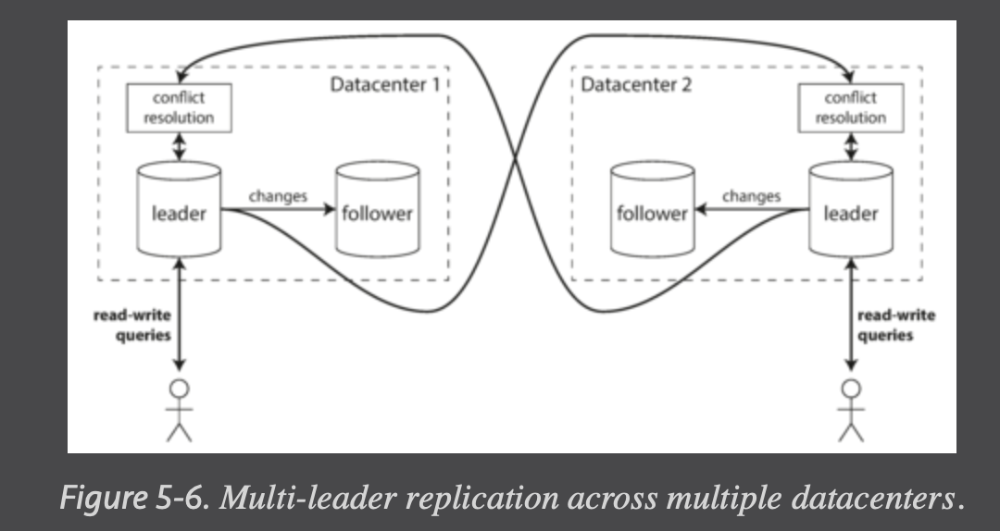
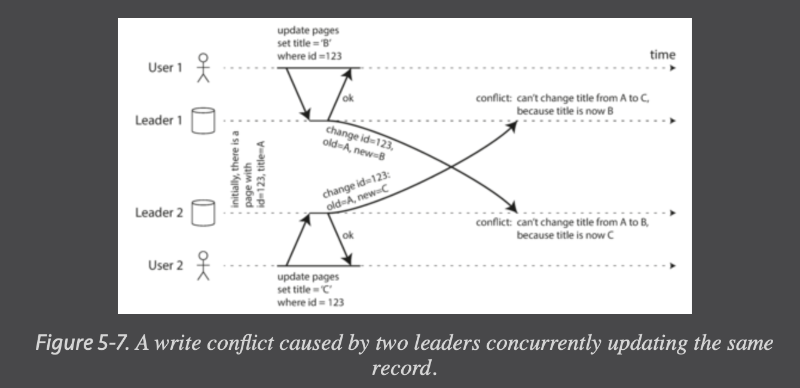
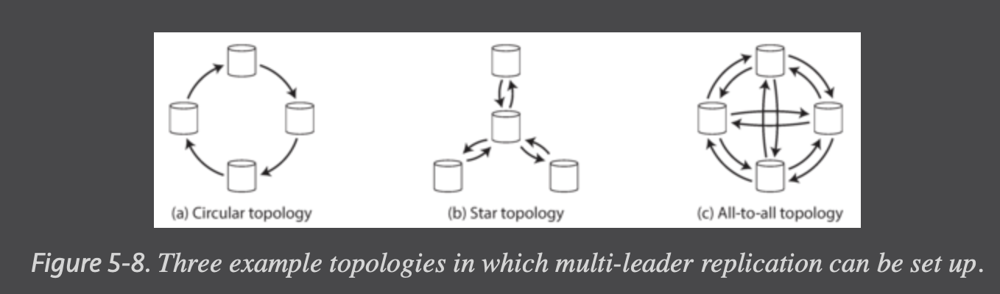
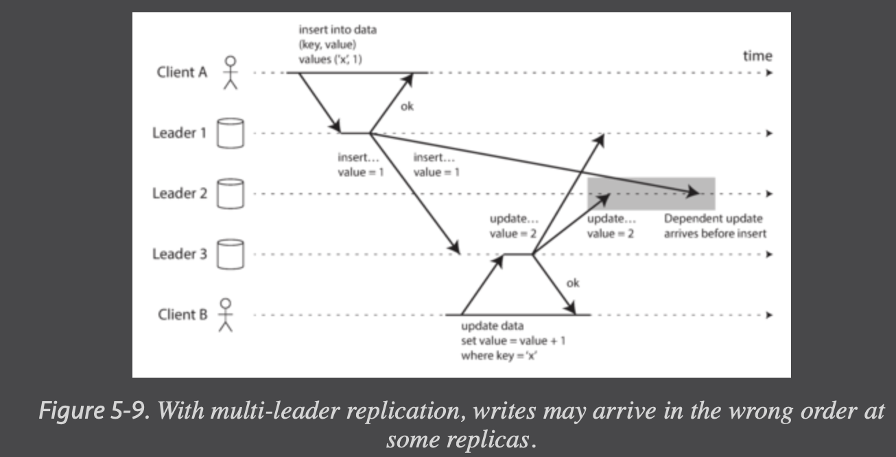

Replication means keeping a copy of the same data on multiple machines that are connected via a network. There are several reasons why you might want to replicate data:

- To keep data geographically close to your users (and thus reduce latency)

- To allow the system to continue working even if some of its parts have failed (and thus increase availability)

- To scale out the number of machines that can serve read queries (and thus increase read throughput)

# Leaders and Followers

Each node that stores a copy of the database is called a replica. Every write to the database needs to be processed by every replica; otherwise, the replicas would no longer contain the same data. The most common solution for this is called leader-based replication (also known as active/passive or master–slave replication)

- One of the replicas is designated the leader (also known as master or primary). When clients want to write to the database, they must send their requests to the leader, which first writes the new data to its local storage.

- The other replicas are known as followers (read replicas, slaves, secondaries, or hot standbys).i Whenever the leader writes new data to its local storage, it also sends the data change to all of its followers as part of a replication log or change stream. Each follower takes the log from the leader and updates its local copy of the database accordingly, by applying all writes in the same order as they were processed on the leader.

- When a client wants to read from the database, it can query either the leader or any of the followers. However, writes are only accepted on the leader (the followers are read-only from the client’s point of view).

## Synchronous Versus Asynchronous Replication

Normally, replication is quite fast: most database systems apply changes to followers in less than a second. However, there is no guarantee of how long it might take. There are circumstances when followers might fall behind the leader by several minutes or more; for example, if a follower is recovering from a failure, if the system is operating near maximum capacity, or if there are network problems between the nodes.

The advantage of synchronous replication is that the follower is guaranteed to have an up-to-date copy of the data that is consistent with the leader. If the leader suddenly fails, we can be sure that the data is still available on the follower. The disadvantage is that if the synchronous follower doesn’t respond (because it has crashed, or there is a network fault, or for any other reason), the write cannot be processed. The leader must block all writes and wait until the synchronous replica is available again.

For that reason, it is impractical for all followers to be synchronous: any one node outage would cause the whole system to grind to a halt. In practice, if you enable synchronous replication on a database, it usually means that one of the followers is synchronous, and the others are asynchronous. If the synchronous follower becomes unavailable or slow, one of the asynchronous followers is made synchronous. This guarantees that you have an up-to-date copy of the data on at least two nodes: the leader and one synchronous follower. This configuration is sometimes also called semi-synchronous.

Often, leader-based replication is configured to be completely asynchronous. In this case, if the leader fails and is not recoverable, any writes that have not yet been replicated to followers are lost. This means that a write is not guaranteed to be durable, even if it has been confirmed to the client. However, a fully asynchronous configuration has the advantage that the leader can continue processing writes, even if all of its followers have fallen behind.

> Weakening durability may sound like a bad trade-off, but asynchronous replication is nevertheless widely used, especially if there are many followers or if they are geographically distributed.

## Setting Up New Followers

Simply copying data files from one node to another is typically not sufficient: clients are constantly writing to the database, and the data is always in flux, so a standard file copy would see different parts of the database at different points in time. The result might not make any sense.

Set up Follower process:

1. Take a snapshot from leader database.
2. Copy it to the new node.
3. Follower ask leader for the data changes after snapshot's checkpoint.
4. When the follower has processed the backlog of data changes since the snapshot, we say it has caught up. It can now continue to process data changes from the leader as they happen.

## Handling Node Outages

Any node in the system can go down, perhaps unexpectedly due to a fault, but just as likely due to planned maintenance. Being able to reboot individual nodes without downtime is a big advantage for operations and maintenance. Thus, our goal is to keep the system as a whole running despite individual node failures, and to keep the impact of a node outage as small as possible.

### Follower failure: Catch-up recovery

On its local disk, each follower keeps a log of the data changes it has received from the leader. If a follower crashes and is restarted, or if the network between the leader and the follower is temporarily interrupted, the follower can recover quite easily: from its log, it knows the last transaction that was processed before the fault occurred. Thus, the follower can connect to the leader and request all the data changes that occurred during the time when the follower was disconnected. When it has applied these changes, it has caught up to the leader and can continue receiving a stream of data changes as before.

> e.g Commit Log

### Leader failure: Failover

Handling a failure of the leader is trickier: one of the followers needs to be promoted to be the new leader, clients need to be reconfigured to send their writes to the new leader, and the other followers need to start consuming data changes from the new leader. This process is called failover. Failover can happen manually (an administrator is notified that the leader has failed and takes the necessary steps to make a new leader) or automatically. An automatic failover process usually consists of the following steps:

1. Determining that the leader has failed. There are many things that could potentially go wrong: crashes, power outages, network issues, and more. There is no foolproof way of detecting what has gone wrong, so most systems simply use a timeout: nodes frequently bounce messages back and forth between each other, and if a node doesn’t respond for some period of time—say, 30 seconds—it is assumed to be dead. (If the leader is deliberately taken down for planned maintenance, this doesn’t apply.)

2. Choosing a new leader. This could be done through an election process (where the leader is chosen by a majority of the remaining replicas), or a new leader could be appointed by a previously elected controller node. The best candidate for leadership is usually the replica with the most up-to-date data changes from the old leader (to minimize any data loss). Getting all the nodes to agree on a new leader is a consensus problem.

3. Reconfiguring the system to use the new leader. Clients now need to send their write requests to the new leader (we discuss this in “Request Routing”). If the old leader comes back, it might still believe that it is the leader, not realizing that the other replicas have forced it to step down. The system needs to ensure that the old leader becomes a follower and recognizes the new leader.

Failover is fraught with things that can go wrong:

- If asynchronous replication is used, the new leader may not have received all the writes from the old leader before it failed. If the former leader rejoins the cluster after a new leader has been chosen, what should happen to those writes? The new leader may have received conflicting writes in the meantime. The most common solution is for the old leader’s unreplicated writes to simply be discarded, which may violate clients’ durability expectations.

- Discarding writes is especially dangerous if other storage systems outside of the database need to be coordinated with the database contents. For example, in one incident at GitHub [13], an out-of-date MySQL follower was promoted to leader. The database used an autoincrementing counter to assign primary keys to new rows, but because the new leader’s counter lagged behind the old leader’s, it reused some primary keys that were previously assigned by the old leader. These primary keys were also used in a Redis store, so the reuse of primary keys resulted in inconsistency between MySQL and Redis, which caused some private data to be disclosed to the wrong users.

- In certain fault scenarios (see Chapter 8), it could happen that two nodes both believe that they are the leader. This situation is called **split brain**, and it is dangerous: if both leaders accept writes, and there is no process for resolving conflicts (see “Multi-Leader Replication”), data is likely to be lost or corrupted. As a safety catch, some systems have a mechanism to shut down one node if two leaders are detected. However, if this mechanism is not carefully designed, you can end up with both nodes being shut down.

- What is the right timeout before the leader is declared dead? A longer timeout means a longer time to recovery in the case where the leader fails. However, if the timeout is too short, there could be unnecessary failovers. For example, a temporary load spike could cause a node’s response time to increase above the timeout, or a network glitch could cause delayed packets. If the system is already struggling with high load or network problems, an unnecessary failover is likely to make the situation worse, not better.

## Implementation of Replication Logs

How does leader-based replication work under the hood? Several different replication methods are used in practice, so let’s look at each one briefly.

### Statement-based replication

In the simplest case, the leader logs every write request (statement) that it executes and sends that statement log to its followers. For a relational database, this means that every INSERT, UPDATE, or DELETE statement is forwarded to followers, and each follower parses and executes that SQL statement as if it had been received from a client.

Although this may sound reasonable, there are various ways in which this approach to replication can break down:

- Any statement that calls a nondeterministic function, such as NOW() to get the current date and time or RAND() to get a random number, is likely to generate a different value on each replica.

- If statements use an autoincrementing column, or if they depend on the existing data in the database (e.g., UPDATE … WHERE <some condition>), they must be executed in exactly the same order on each replica, or else they may have a different effect. This can be limiting when there are multiple concurrently executing transactions.

- Statements that have side effects (e.g., triggers, stored procedures, user-defined functions) may result in different side effects occurring on each replica, unless the side effects are absolutely deterministic.

It is possible to work around those issues—for example, the leader can replace any nondeterministic function calls with a fixed return value when the statement is logged so that the followers all get the same value. However, because there are so many edge cases, other replication methods are now generally preferred.

### Write-ahead log (WAL) shipping

In Chapter 3 we discussed how storage engines represent data on disk, and we found that usually every write is appended to a log:

- In the case of a log-structured storage engine (see “SSTables and LSM-Trees”), this log is the main place for storage. Log segments are comes pacted and garbage-collected in the background.

- In the case of a B-tree (see “B-Trees”), which overwrites individual disk blocks, every modification is first written to a write-ahead log so that the index can be restored to a consistent state after a crash.

In either case, the log is an append-only sequence of bytes containing all writes to the database. We can use the exact same log to build a replica on another node: besides writing the log to disk, the leader also sends it across the network to its followers. When the follower processes this log, it builds a copy of the exact same data structures as found on the leader.

The main disadvantage is that the log describes the data on a very low level: a WAL contains details of which bytes were changed in which disk blocks. This makes replication closely coupled to the storage engine. If the database changes its storage format from one version to another, it is typically not possible to run different versions of the database software on the leader and the followers.

That may seem like a minor implementation detail, but it can have a big operational impact. If the replication protocol allows the follower to use a newer software version than the leader, you can perform a zero-downtime upgrade of the database software by first upgrading the followers and then performing a failover to make one of the upgraded nodes the new leader. If the replication protocol does not allow this version mismatch, as is often the case with WAL shipping, such upgrades require downtime.

> Often couple to on disk storage format. Does not play well with having different versions of leader and followers.

### Logical (row-based) log replication

An alternative is to use different log formats for replication and for the storage engine, which allows the replication log to be decoupled from the storage engine internals. This kind of replication log is called a **logical log**, to distinguish it from the storage engine’s (physical) data representation.
A logical log for a relational database is usually a sequence of records describing writes to database tables at the granularity of a row:

- For an inserted row, the log contains the new values of all columns.

- For a deleted row, the log contains enough information to uniquely identify the row that was deleted. Typically this would be the primary key, but if there is no primary key on the table, the old values of all columns need to be logged.

- For an updated row, the log contains enough information to uniquely identify the updated row, and the new values of all columns (or at least the new values of all columns that changed).

A transaction that modifies several rows generates several such log records, followed by a record indicating that the transaction was committed.

Since a logical log is decoupled from the storage engine internals, it can more easily be kept backward compatible, allowing the leader and the follower to run different versions of the database software, or even different storage engines.

A logical log format is also easier for external applications to parse. This aspect is useful if you want to send the contents of a database to an external system, such as a data warehouse for offline analysis, or for building custom indexes and caches. This technique is called **change data capture (CDC)**.

### Trigger-based replication

The replication approaches described so far are implemented by the database system, without involving any application code. In many cases, that’s what you want—but there are some circumstances where more flexibility is needed. For example, if you want to only replicate a subset of the data, or want to replicate from one kind of database to another, or if you need conflict resolution logic, then you may need to move replication up to the application layer.

A trigger lets you register custom application code that is automatically executed when a data change (write transaction) occurs in a database system. The trigger has the opportunity to log this change into a separate table, from which it can be read by an external process. That external process can then apply any necessary application logic and replicate the data change to another system.

Trigger-based replication typically has greater overheads than other replication methods, and is more prone to bugs and limitations than the database’s built-in replication. However, it can nevertheless be useful due to its flexibility.

> Read database's change feed and forward to other places in an application

# Problems with Replication Lag

Being able to tolerate node failures is just one reason for wanting replication. As mentioned in the introduction to Part II, other reasons are scalability (processing more requests than a single machine can handle) and latency (placing replicas geographically closer to users).

Leader-based replication requires all writes to go through a single node, but read-only queries can go to any replica. For workloads that consist of mostly reads and only a small percentage of writes (a common pattern on the web), there is an attractive option: create many followers, and distribute the read requests across those followers. This removes load from the leader and allows read requests to be served by nearby replicas.

In this read-scaling architecture, you can increase the capacity for serving read-only requests simply by adding more followers. However, this approach only realistically works with asynchronous replication—if you tried to synchronously replicate to all followers, a single node failure or network outage would make the entire system unavailable for writing. And the more nodes you have, the likelier it is that one will be down, so a fully synchronous configuration would be very unreliable.

Unfortunately, if an application reads from an asynchronous follower, it may see outdated information if the follower has fallen behind. This leads to apparent inconsistencies in the database: if you run the same query on the leader and a follower at the same time, you may get different results, because not all writes have been reflected in the follower. This inconsistency is just a temporary state—if you stop writing to the database and wait a while, the followers will eventually catch up and become consistent with the leader. For that reason, this effect is known as eventual consistency.

## Reading Your Own writes

When new data is submitted, it must be sent to the leader, but when the user views the data, it can be read from a follower. This is especially appropriate if data is frequently viewed but only occasionally written.

With asynchronous replication, there is a problem, illustrated in Figure 5-3: if the user views the data shortly after making a write, the new data may not yet have reached the replica. To the user, it looks as though the data they submitted was lost, so they will be understandably unhappy.

In this situation, we need read-after-write consistency, also known as read-your-writes consistency. This is a guarantee that if the user reloads the page, they will always see any updates they submitted themselves. It makes no promises about other users: other users’ updates may not be visible until some later time. However, it reassures the user that their own input has been saved correctly.

Scenarios:

- When reading something that the user may have modified, read it from the leader; otherwise, read it from a follower. This requires that you have some way of knowing whether something might have been modified, without actually querying it. For example, user profile information on a social network is normally only editable by the owner of the profile, not by anybody else. Thus, a simple rule is: always read the user’s own profile from the leader, and any other users’ profiles from a follower.

- If most things in the application are potentially editable by the user, that approach won’t be effective, as most things would have to be read from the leader (negating the benefit of read scaling). In that case, other criteria may be used to decide whether to read from the leader. For example, you could **track the time of the last update and, for one minute after the last update, make all reads from the leader**. You could also monitor the replication lag on followers and prevent queries on any follower that is more than one minute behind the leader.

- The client can remember the timestamp of its most recent write—then the system can ensure that the replica serving any reads for that user reflects updates at least until that timestamp. If a replica is not sufficiently up to date, either the read can be handled by another replica or the query can wait until the replica has caught up. The timestamp could be a logical timestamp (something that indicates ordering of writes, such as the log sequence number) or the actual system clock (in which case clock synchronization becomes critical)

- If your replicas are distributed across multiple datacenters (for geographical proximity to users or for availability), there is additional complexity. Any request that needs to be served by the leader must be routed to the datacenter that contains the leader.

Cross device read-after-write consistency:

- Approaches that require remembering the timestamp of the user’s last update become more difficult, because the code running on one device doesn’t know what updates have happened on the other device. This metadata will need to be centralized.

- If your replicas are distributed across different datacenters, there is no guarantee that connections from different devices will be routed to the same datacenter. (For example, if the user’s desktop computer uses the home broadband connection and their mobile device uses the cellular data network, the devices’ network routes may be completely different.) If your approach requires reading from the leader, you may first need to route requests from all of a user’s devices to the same datacenter.

## Monotonic Reads

Our second example of an anomaly that can occur when reading from asynchronous followers is that it’s possible for a user to see things moving backward in time.

Monotonic reads is a guarantee that this kind of anomaly does not happen. It’s a lesser guarantee than strong consistency, but a stronger guarantee than eventual consistency. When you read data, you may see an old value; monotonic reads only means that if one user makes several reads in sequence, they will not see time go backward—i.e., they will not read older data after having previously read newer data.

## Consistent Prefix Reads

Our third example of replication lag anomalies concerns violation of causality.

Preventing this kind of anomaly requires another type of guarantee: consistent prefix reads. This guarantee says that if **a sequence of writes happens in a certain order, then anyone reading those writes will see them appear in the same order**.

This is a particular problem in partitioned (sharded) databases. If the database always applies writes in the same order, reads always see a consistent prefix, so this anomaly cannot happen. However, in many distributed databases, different partitions operate independently, so there is no global ordering of writes: when a user reads from the database, they may see some parts of the database in an older state and some in a newer state.

One solution is to make sure that any writes that are causally related to each other are written to the same partition—but in some applications that cannot be done efficiently. There are also a keep track of causal dependencies, a topic that we will return to in “The “happens-before” relationship and concurrency".

## Solutions for Replication Lag

As discussed earlier, there are ways in which an application can provide a stronger guarantee than the underlying database—for example, by performing certain kinds of reads on the leader. However, dealing with these issues in application code is complex and easy to get wrong.

It would be better if application developers didn’t have to worry about subtle replication issues and could just trust their databases to “do the right thing.” This is why transactions exist: they are a way for a database to provide stronger guarantees so that the application can be simpler.

# Multi-Leader Replication

Leader-based replication has one major downside: there is only one leader, and all writes must go through it.iv If you can’t connect to the leader for any reason, for example due to a network interruption between you and the leader, you can’t write to the database.

A natural extension of the leader-based replication model is to allow more than one node to accept writes. Replication still happens in the same way: each node that processes a write must forward that data change to all the other nodes. We call this a multi-leader configuration (also known as master–master or active/active replication). In this setup, each leader simultaneously acts as a follower to the other leaders.

## Use Cases for Multi-Leader Replication

### Multi-datacenter operations

In a multi-leader configuration, you can have a leader in each datacenter. Figure 5-6 shows what this architecture might look like. Within each datacenter, regular leader–follower replication is used; between datacenters, each datacenter’s leader replicates its changes to the leaders in other datacenters.

- Performance

  - In a single-leader configuration, every write must go over the internet to the datacenter with the leader. This can add significant latency to writes and might contravene the purpose of having multiple datacenters in the first place. In a multi-leader configuration, every write can be processed in the local datacenter and is replicated asynchronously to the other datacenters. Thus, the inter-datacenter network delay is hidden from users, which means the perceived performance may be better.

- Tolerance of datacenter outages

  - In a single-leader configuration, if the datacenter with the leader fails, failover can promote a follower in another datacenter to be leader. In a multi-leader configuration, each datacenter can continue operating independently of the others, and replication catches up when the failed datacenter comes back online.

- Tolerance of network problems
  - Traffic between datacenters usually goes over the public internet, which may be less reliable than the local network within a datacenter. A single-leader configuration is very sensitive to problems in this inter-datacenter link, because writes are made synchronously over this link. A multi-leader configuration with asynchronous replication can usually tolerate network problems better: a temporary network interruption does not prevent writes being processed.

Although multi-leader replication has advantages, it also has a big downside: the same data may be concurrently modified in two different datacenters, and those write conflicts must be resolved (indicated as “conflict resolution” in Figure 5-6).

As multi-leader replication is a somewhat retrofitted feature in many databases, there are often subtle configuration pitfalls and surprising interactions with other database features. For example, autoincrementing keys, triggers, and integrity constraints can be problematic. For this reason, multi-leader replication is often considered dangerous territory that should be avoided if possible.

### Clients with offline operations

Another situation in which multi-leader replication is appropriate is if you have an application that needs to continue to work while it is disconnected from the internet.

Think about calendar apps on the phone where every device has a local database that acts as a leader (it accepts write requests), and there is an asynchronous multi-leader replication process (sync) between the replicas of your calendar on all of your devices. The replication lag may be hours or even days, depending on when you have internet access available.

From an architectural point of view, this setup is essentially the same as multi-leader replication between datacenters, taken to the extreme: each device is a “datacenter,” and the network connection between them is extremely unreliable. As the rich history of broken calendar sync implementations demonstrates, multi-leader replication is a tricky thing to get right.

### Colloaborative editing

Real-time collaborative editing applications allow several people to edit a document simultaneously.

We don’t usually think of collaborative editing as a database replication problem, but it has a lot in common with the previously mentioned offline editing use case. When one user edits a document, the changes are instantly applied to their local replica (the state of the document in their web browser or client application) and asynchronously replicated to the server and any other users who are editing the same document.

If you want to guarantee that there will be no editing conflicts, the application must obtain a lock on the document before a user can edit it. If another user wants to edit the same document, they first have to wait until the first user has committed their changes and released the lock. This collaboration model is equivalent to single-leader replication with transactions on the leader.

However, for faster collaboration, you may want to make the unit of change very small (e.g., a single keystroke) and avoid locking. This approach allows multiple users to edit simultaneously, but it also brings all the challenges of multi-leader replication, including requiring conflict resolution.

## Handling Write Conflicts

The biggest problem with multi-leader replication is that write conflicts can occur, which means that conflict resolution is required.

### Synchronous versus asynchronous conflict detection

In a single-leader database, the second writer will either block and wait for the first write to complete, or abort the second write transaction, forcing the user to retry the write. On the other hand, in a multi-leader setup, both writes are successful, and the conflict is only detected asynchronously at some later point in time. At that time, it may be too late to ask the user to resolve the conflict.

In principle, you could make the conflict detection synchronous—i.e., wait for the write to be replicated to all replicas before telling the user that the write was successful. However, by doing so, you would lose the main advantage of multi-leader replication: allowing each replica to accept writes independently. If you want synchronous conflict detection, you might as well just use single-leader replication.

### Conflict avoidance

The simplest strategy for dealing with conflicts is to avoid them: if the application can ensure that all writes for a particular record go through the same leader, then conflicts cannot occur. Since many implementations of multi-leader replication handle conflicts quite poorly, avoiding conflicts is a frequently recommended approach.

For example, in an application where a user can edit their own data, you can ensure that requests from a particular user are always routed to the same datacenter and use the leader in that datacenter for reading and writing. Different users may have different “home” datacenters (perhaps picked based on geographic proximity to the user), but from any one user’s point of view the configuration is essentially single-leader.

However, sometimes you might want to change the designated leader for a record—perhaps because one datacenter has failed and you need to reroute traffic to another datacenter, or perhaps because a user has moved to a different location and is now closer to a different datacenter. In this situation, conflict avoidance breaks down, and you have to deal with the possibility of concurrent writes on different leaders.

### Converging toward a consistent state

A single-leader database applies writes in a sequential order: if there are several updates to the same field, the last write determines the final value of the field.

In a multi-leader configuration, there is no defined ordering of writes, so it’s not clear what the final value should be. In Figure 5-7, at leader 1 the title is first updated to B and then to C; at leader 2 it is first updated to C and then to B. Neither order is “more correct” than the other.

If each replica simply applied writes in the order that it saw the writes, the database would end up in an inconsistent state: the final value would be C at leader 1 and B at leader 2. That is not acceptable—every replication scheme must ensure that the data is eventually the same in all replicas. Thus, the database must resolve the conflict in a convergent way, which means that all replicas must arrive at the same final value when all changes have been replicated.

Various ways of achieving convergent conflict resolution:

- Give each write a unique ID (e.g., a timestamp, a long random number, a UUID, or a hash of the key and value), pick the write with the highest ID as the winner, and throw away the other writes. If a timestamp is used, this technique is known as **last write wins (LWW)**. Although this approach is popular, it is dangerously prone to data loss

- Give each replica a unique ID, and let writes that originated at a higher-numbered replica always take precedence over writes that originated at a lower-numbered replica. This approach also implies data loss.

- Somehow merge the values together—e.g., order them alphabetically and then concatenate them (in Figure 5-7, the merged title might be something like “B/C”).

- Record the conflict in an explicit data structure that preserves all information, and write application code that resolves the conflict at some later time (perhaps by prompting the user).

### Custom conflict resolution logic

As the most appropriate way of resolving a conflict may depend on the application, most multi-leader replication tools let you write conflict resolution logic using application code. That code may be executed on write or on read:

- On write

  - As soon as the database system detects a conflict in the log of replicated changes, it calls the conflict handler. This handler typically cannot prompt a user—it runs in a background process and it must execute quickly.

- On read
  - When a conflict is detected, all the conflicting writes are stored. The next time the data is read, these multiple versions of the data are returned to the application. The application may prompt the user or automatically resolve the conflict, and write the result back to the database.

Note that conflict resolution usually applies at the level of an individual row or document, not for an entire transaction. Thus, if you have a transaction that atomically makes several different writes, each write is still considered separately for the purposes of conflict resolution.

Conflict-free replicated datatypes (CRDTs) are a family of data structures for sets, maps, ordered lists, counters, etc. that can be concurrently edited by multiple users, and which automatically resolve conflicts in sensible ways.

https://zed.dev/blog/crdts

## Multi-Leader Replication Topologies

A replication topology describes the communication paths along which writes are propagated from one node to another. If you have two leaders, like in Figure 5-7, there is only one plausible topology: leader 1 must send all of its writes to leader 2, and vice versa. With more than two leaders, various different topologies are possible. Some examples are illustrated in Figure 5-8.

The most general topology is all-to-all (Figure 5-8 [c]), in which every leader sends its writes to every other leader. However, more restricted topologies are also used: for example, MySQL by default supports only a circular topology, in which each node receives writes from one node and forwards those writes (plus any writes of its own) to one other node. Another popular topology has the shape of a star:v one designated root node forwards writes to all of the other nodes. The star topology can be generalized to a tree.

In circular and star topologies, a write may need to pass through several nodes before it reaches all replicas. Therefore, nodes need to forward data changes they receive from other nodes. To prevent infinite replication loops, each node is given a unique identifier, and in the replication log, each write is tagged with the identifiers of all the nodes it has passed through. When a node receives a data change that is tagged with its own identifier, that data change is ignored, because the node knows that it has already been processed.

> Use unique identifier to prevent infinite replication loop.

A problem with circular and star topologies is that if just one node fails, it can interrupt the flow of replication messages between other nodes, causing them to be unable to communicate until the node is fixed. The topology could be reconfigured to work around the failed node, but in most deployments such reconfiguration would have to be done manually. The fault tolerance of a more densely connected topology (such as all-to-all) is better because it allows messages to travel along different paths, avoiding a single point of failure.

This is a problem of causality, similar to the one we saw in “Consistent Prefix Reads”: the update depends on the prior insert, so we need to make sure that all nodes process the insert first, and then the update.

Simply attaching a timestamp to every write is not sufficient, because clocks cannot be trusted to be sufficiently in sync to correctly order these events at leader 2.

To order these events correctly, a technique called version vectors can be used. However, conflict detection techniques are poorly implemented in many multi-leader replication systems.

# Leaderless Replication
